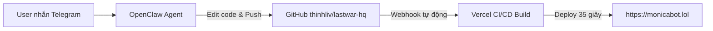

# ⚔️ Monica Bot Storefront (Team Murphy) — monicabot.lol

> **Website chính thức:** [https://monicabot.lol](https://monicabot.lol) | [https://www.monicabot.lol](https://www.monicabot.lol)  
> **GitHub Repository:** [https://github.com/thinhliv/lastwar-hq](https://github.com/thinhliv/lastwar-hq) (Branch `master`)  
> **Vercel Project:** `thinhliv-1520s-projects/web` (Root directory: `apps/web`)  
> **DNS Registrar:** Porkbun (`A`: `76.76.21.21`, `CNAME www`: `cname.vercel-dns.com`)

---

## 🤖 HƯỚNG DẪN DÀNH CHO OPENCLAW (Điều khiển từ xa qua Telegram khi tắt máy)

Hệ thống CI/CD đã được cấu hình **hoàn toàn tự động 100%**:



### ⚡ Nguyên tắc vận hành:
1. Khi máy tính tắt, OpenClaw làm việc trực tiếp với kho lưu trữ GitHub `thinhliv/lastwar-hq`.
2. Khi OpenClaw thực hiện commit và push lên branch `master`, Vercel sẽ tự động phát hiện webhook, biên dịch Next.js 16 và cập nhật lên tên miền **`monicabot.lol`** trong vòng ~35 giây.
3. Không cần can thiệp thủ công vào Vercel hay Porkbun.

---

## 📂 CẤU TRÚC THƯ MỤC & VỊ TRÍ CÁC FILE QUAN TRỌNG

Mã nguồn trang web nằm tại: `apps/web/`

```text
monicabot/
├── apps/
│   └── web/
│       ├── public/
│       │   └── images/bot/             # Ảnh chụp các bước, bảng giá, app preview
│       ├── src/
│       │   ├── app/
│       │   │   ├── layout.tsx          # Metadata SEO, title, favicon, OpenGraph
│       │   │   ├── page.tsx            # Trang chủ kết nối các component
│       │   │   ├── robots.ts           # Cấu hình robot crawler
│       │   │   ├── sitemap.ts          # Sitemap Google index
│       │   │   └── globals.css         # Theme màu Style 8 (Crimson Duel War Room)
│       │   ├── components/
│       │   │   ├── Navbar.tsx          # Thanh điều hướng trên cùng
│       │   │   ├── VideoSection.tsx    # Nhúng video YouTube và tabs demo
│       │   │   ├── FeaturesSection.tsx # Danh sách 6 tính năng cốt lõi của Tool
│       │   │   ├── StepByStepGuide.tsx # Hướng dẫn 4 bước (BẮT BUỘC chọn Team Murphy)
│       │   │   ├── PricingSection.tsx  # Bảng giá VND & USDT, nút mua key
│       │   │   ├── FAQSection.tsx      # Giải đáp câu hỏi thường gặp
│       │   │   └── BottomNav.tsx       # Thanh điều hướng di động chân trang
│       │   ├── data/
│       │   │   └── plans.ts            # Dữ liệu bảng giá các gói (7 ngày, 30 ngày, 1 năm...)
│       │   └── lib/
│       │       └── telegram.ts         # Link Bot (@tool_lastwar_buysell_bot) & Nhóm hỗ trợ
└── README.md
```

---

## 🛠️ CÁC TÁC VỤ THƯỜNG GẶP CHO OPENCLAW

### 1. Cập nhật bảng giá / Gói khuyến mãi
- File: `apps/web/src/data/plans.ts`
- Cập nhật giá gốc (`originalPrice`), giá bán (`priceVnd`, `priceUsd`), hoặc nhãn khuyến mãi (`badge`).

### 2. Thêm / Thay thế Video YouTube
- File: `apps/web/src/components/VideoSection.tsx`
- Sửa mảng `DEMO_VIDEOS`:
  ```ts
  {
    id: "tong-hop",
    title: "Video Tổng Hợp Tính Năng",
    youtubeId: "bkm5aYR6aMk", // Thay ID YouTube tại đây
    badge: "Tổng Quan",
    description: "..."
  }
  ```

### 3. Thay đổi Link Telegram Bot hoặc Nhóm hỗ trợ
- File: `apps/web/src/lib/telegram.ts`
  - Bot chính thức: `https://t.me/tool_lastwar_buysell_bot`
  - Nhóm hỗ trợ: `https://t.me/gametoollastwar`

### 4. Điều chỉnh Hướng dẫn 4 Bước mua hàng
- File: `apps/web/src/components/StepByStepGuide.tsx`
- Đảm bảo bước **Chọn Team Murphy** luôn được làm nổi bật để khách hàng không chọn nhầm đại lý khác.

---

## 💻 LỆNH THAO TÁC TRÊN MÁY TÍNH CỤC BỘ (LOCAL)

Nếu làm việc trực tiếp trên máy tính tại thư mục `C:\Users\Administrator\.gemini\antigravity\scratch\monicabot`:

```bash
# 1. Di chuyển vào thư mục web
cd apps/web

# 2. Chạy môi trường phát triển (Dev server)
npm run dev
# Mở trình duyệt: http://localhost:3000

# 3. Kiểm tra build sản phẩm
npm run build

# 4. Đẩy code lên GitHub (Tự động kích hoạt Vercel deploy lên monicabot.lol)
git add .
git commit -m "Mô tả thay đổi"
git push origin master
```
